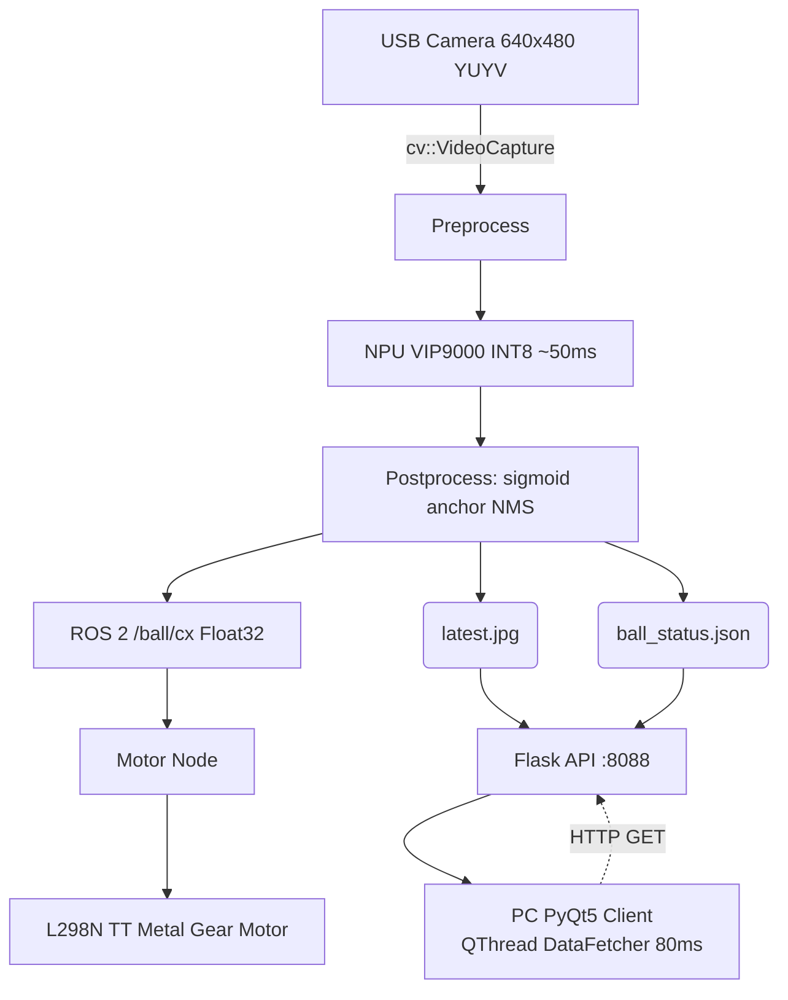

# Orange Pi Zero 3W — YOLOv5 端侧球体检测与小车追踪

> 前端演示（Flask API + PyQt5 客户端）已拆分到 ../yolov5_ROS_2.0_web_monitor/。本文件夹仅保留多线程代码与文档。\n\n## 能用的话来说：整个系统做了什么

```
摄像头拍画面 → 程序找到球 → 用 ROS 2 发球的位置 → 另一个程序驱动小车追球
```

拆成 5 步讲清楚。

---

## 一、怎么读到摄像头画面的

用 OpenCV 的 `cv::VideoCapture` 打开 USB 摄像头。

```cpp
cv::VideoCapture cap;
cap.open(1, cv::CAP_V4L2);
cap.set(cv::CAP_PROP_FRAME_WIDTH, 640);
cap.set(cv::CAP_PROP_FRAME_HEIGHT, 480);
```

- `1` 就是选择 `/dev/video1`（板子上的 USB 摄像头）
- `cv::CAP_V4L2` 让 OpenCV 用 Linux 自带的 V4L2 驱动，不用 GStreamer（因为开发板的 GStreamer 缺插件会报错）
- 640×480 是摄像头的分辨率
- 每帧画面存在 `cv::Mat frame_` 里——就是一个 3 通道的彩色图像矩阵

摄像头拍的画面是横着的，代码里有一行旋转把它转正：

```cpp
cv::rotate(frame_, frame_, cv::ROTATE_90_COUNTERCLOCKWISE);
```

---

## 二、怎么把图片送给 AI 模型推理

### 前处理 (`yolov5_pre_process`)

摄像头出来的图不能直接用——尺寸不对、颜色顺序不对、数据排列不对。前处理做 4 件事：

| 操作 | 做了什么 | 为什么 |
|------|---------|--------|
| BGR 转 RGB | 交换颜色通道顺序 | 训练的模型是 RGB，OpenCV 读出来是 BGR，不一致会认不准 |
| 等比缩放 | 按短边缩放到 640 | 模型输入固定 640×640，不能变 |
| 灰色填充 | 短边两边填灰色(128) | 直接拉伸球会变椭圆，灰色模型训练时见过，能忽略 |
| 转 NCHW 排列 | H×W×C 变成 C×H×W | NPU 硬件要求通道维在前面 |

处理完得到 `[3][640][640]` 的 uint8 数组——这就是 NPU 的输入。

### 加载模型

```cpp
awnn_init();                         // 初始化 NPU 驱动
ctx_ = awnn_create(".../yolov5_ball.nb");  // 加载 NB 模型文件
```

NB 文件是提前在 PC 上用 pegasus 工具把训练好的 PyTorch 模型转成 NPU 能认识的格式。

### 推理

```cpp
void *in[] = {input_data};
awnn_set_input_buffers(ctx_, in);    // 把图送给 NPU
awnn_run(ctx_);                       // NPU 开始算
float **out = awnn_get_output_buffers(ctx_);  // 取结果
```

推理约 50 毫秒，NPU 内部全是用 INT8 整数算的（比浮点快 10 倍但精度稍低）。

### 后处理 (`yolov5_post_process`)

NPU 输出的不是球的位置——是 8400 个候选框的原始分数。后处理做 5 件事：

1. **sigmoid 转换**：把 -14~+12 的原始分数压到 0~1，变成概率
2. **锚框解码**：用预设的 18 个 anchor box + 格子位置 + stride，把相对偏移变成像素坐标
3. **置信度筛选**：`obj × cls > 0.02` 才保留
4. **NMS 去重**：一个球可能被好几个框框住，NMS 按 IoU>0.5 去重只留最可信的
5. **坐标回映射**：从 640×640 的推理空间映射回摄像头的 640×480

结果存到两个全局变量里：

```cpp
g_ball_cx   // 球的水平中心坐标 (0~640)
g_ball_prob // 置信度 (0~1)
```

**重要**：每帧开始时这两个变量会被清零。如果这帧没检测到球，`g_ball_cx` 就是 -1。

---

## 三、ROS 2 怎么通信

### 为什么用 ROS 2

视觉检测和电机控制是两个独立的任务——用 ROS 2 可以把它们拆成两个节点，各管各的，通过**话题**沟通。

### vision_node（视觉节点）

```cpp
// 每 80ms 定时跑一次
timer_ = this->create_wall_timer(std::chrono::milliseconds(80), ...);

void loop() {
    // 1. 读摄像头
    cap_.read(frame_);
    
    // 2. 旋转画面
    cv::rotate(frame_, frame_, cv::ROTATE_90_COUNTERCLOCKWISE);
    
    // 3. 前处理 + NPU推理 + 后处理
    inp = yolov5_pre_process(NULL, &frame_, &fs);
    awnn_set_input_buffers(ctx_, in); awnn_run(ctx_);
    out = awnn_get_output_buffers(ctx_);
    yolov5_post_process(NULL, &frame_, out);
    
    // 4. 发布球的位置
    auto m = std_msgs::msg::Float32();
    m.data = (g_ball_prob > 0.3) ? g_ball_cx : -1.0f;
    pub_->publish(m);
    
    // 5. 存一张最新画面（方便 PC 远程查看）
    cv::imwrite("/tmp/latest.jpg", frame_);
}
```

发布到话题 `/ball/cx`——有球就发位置 (0~640)，没球就发 -1。

### motor_node（电机控制节点）

```cpp
// 订阅 /ball/cx 话题
sub_ = this->create_subscription<std_msgs::msg::Float32>("/ball/cx", ...);

void cb(const Float32 msg) {
    float cx = msg.data;
    if (cx < 0) { motor_stop(); return; }   // 没球就停
    
    float d = cx - 320;   // 球偏画面中心多少
    
    if (d < -50)        motor_raw(0,1,0,1);   // 球在左边 → 左转
    else if (d > 50)    motor_raw(1,0,1,0);   // 球在右边 → 右转
    else                motor_raw(0,1,1,0);   // 球在中间 → 前进
    
    sleep(50ms);         // 转一小下
    motor_stop();        // 停
}
```

50 是死区阈值——球在画面中间 50 像素范围内不走旁路，直接前进。

**握手机制**：如果视觉节点断了（1 秒没收到消息），watchdog 定时器自动停电机。

---

## 四、怎么控制电机

### 硬件

```
Orange Pi GPIO         L298N 电机驱动板
wPi 8  (排针 15)  →  IN1  右轮正反转
wPi 9  (排针 16)  →  IN2  右轮正反转
wPi 13 (排针 22)  →  IN3  左轮正反转
wPi 14 (排针 23)  →  IN4  左轮正反转
物理 14 (GND)     →  GND  (共地)
```

### 控制方式

```cpp
system("gpio write 8 1");  // 给 wPi 8 高电平
system("gpio write 9 0");  // 给 wPi 9 低电平
```

通过 `motor_raw(右IN1, 右IN2, 左IN1, 左IN2)` 统一拼命令字符串。

实测确认的方向：

| 动作 | 右电机 | 左电机 | 效果 |
|------|--------|--------|------|
| 前进 | (0,1) | (1,0) | 两轮正转 |
| 后退 | (1,0) | (0,1) | 两轮反转 |
| 左转 | (0,1) | (0,1) | 右前+左后 |
| 右转 | (1,0) | (1,0) | 右后+左前 |
| 停止 | (0,0) | (0,0) | 都不动 |

### 供电

18650 电池 (2节串联, 7.4V) → L298N → 4 个电机
充电宝 (5V USB-C) → Orange Pi + 摄像头

两套电独立——电机启动瞬间大电流不会让 Orange Pi 掉电。

---

## 五、怎么编译和运行

### 编译

```bash
# 进工作空间
cd ~/catkin_ws

# 改了什么就只编哪个包（省时间）
colcon build --packages-select yolov5_vision    # 改了视觉代码
colcon build --packages-select motor_control    # 改了电机代码

# 加载环境
source install/local_setup.bash
```

### 运行

```bash
# 终端 1（后台）：跑视觉节点
~/catkin_ws/install/yolov5_vision/lib/yolov5_vision/vision_node 0 &>/dev/null &

# 终端 2（后台）：跑电机节点
~/catkin_ws/install/motor_control/lib/motor_control/motor_node &>/dev/null &

# PC 远程看画面
浏览器打开 http://板子IP:8080/latest.jpg
```

---

## 六、关键踩坑记录

1. **量化后置信度通道全零**：YOLOv8 把 bbox(0~640) 和 class(-5~5) 绑在一起量化，步长 2.53 把 class 的精值全 round 成 0。YOLOv5 拆成 3 个独立输出头 + 在 C++ 做 decode 解决。

2. **摄像头打开卡死**：原用 cv::VideoCapture 默认 GStreamer 拆件失败。改 `cv::CAP_V4L2` 就好了。

3. **摄像头画面旋转**：拍出来横着 90 度，`cv::rotate(ROTATE_90_COUNTERCLOCKWISE)` 转正。

4. **球消失后车接着转**：后处理没清空全局变量，旧坐标残留。每帧先清零再赋值解决。

5. **GPIO 左右接反**：IN1/IN2 实际控制右边，IN3/IN4 控制左边——和代码里左右颠倒了。对调 `motor_raw` 参数解决。

6. **电机卡转**：视觉节点断连时，电机保持上级方向转。加 watchdog 每 0.2 秒检查一次，超时 1 秒自动停。


---
---

## 七、Web 远程监控前端（Flask + PyQt5）— v2.0 新增

### 为什么加

v1.0 时调试全靠板端终端输出和 scp 拉图片，效率低。v2.0 引入前后端分离的远程监控——板端提供 HTTP API，PC 端桌面客户端实时查看画面和状态，还能按钮手动控制电机。



### 系统架构

```
板端 Orange Pi                         PC 端
┌─────────────────────┐              ┌──────────────────────┐
│ vision_node          │              │ PyQt5 桌面客户端      │
│  每帧写 JSON + JPEG  │              │                      │
│        ↓             │   HTTP GET   │ 实时画面 (80ms刷新)   │
│ Flask API :8088 ─────┼───────────→  │ 球位置 + 推理耗时     │
│ /api/status           │              │ 延迟曲线             │
│ /latest.jpg           │              │ 手动电机按钮         │
│ /api/motor/<cmd>      │              │ 命令执行日志         │
└─────────────────────┘              └──────────────────────┘
```

### 板端：Flask HTTP API 服务

`api_server.py` 提供三个接口：

| 路由 | 方法 | 返回 | 用途 |
|------|------|------|------|
| `/api/status` | GET | `{"cx":320,"prob":0.95,"latency":47}` (JSON) | PC 端显示球位置和推理耗时 |
| `/latest.jpg` | GET | JPEG 图片 | PC 端显示带检测框的实时画面 |
| `/api/motor/<cmd>` | GET | `ok` | 手动控制电机：f/前进 b/后退 l/左转 r/右转 s/停止，200ms后自动停车 |

`vision_node.cpp` 每帧先写 `/tmp/ball_status_tmp.json` → `rename` 为 `/tmp/ball_status.json`，JPEG 同理——原子操作，PC 端永远读不到半截数据。

### PC 端：PyQt5 桌面客户端

双击 `start.bat` 启动，界面包含四个区域：

| 区域 | 技术 | 功能 |
|------|------|------|
| 摄像头画面 640x480 | QLabel + QPixmap | 每 80ms 刷新，自动缩放 |
| 球位置 + 耗时 | QLabel 文本 | `cx: 320  prob: 0.95  ms: 47` |
| 延迟曲线 | QPainter 自绘 | 最近 100 帧的推理耗时趋势，绿色曲线，不依赖 pyqtgraph |
| 电机按钮 | QPushButton x5 | 停止/前进/左转/右转/后退，点击即 HTTP GET |
| 命令日志 | QTextEdit | 记录每次按钮操作 |

### 关键优化

| 优化 | 技术 | 效果 |
|------|------|------|
| 后台网络请求 | `QThread` + `pyqtSignal` | HTTP 请求不阻塞 UI 线程，画面流畅 |
| 原子文件写入 | `rename()` | PC 端不会读到半截 JPEG |
| 优雅退出 | `closeEvent` → `wait(2000)` | 关闭窗口时后台线程正常结束 |
| 不阻塞 ROS 2 | HTTP API 与 motor_node 话题互不干扰 | 电机手动/自动可同时存在 |
| 延迟曲线自绘 | QPainter drawLine | 不依赖第三方库 pyqtgraph，避免 Qt 渲染冲突 |

### 使用方法

```bash
# 板端（依赖 vision_node 已在运行）
python3 api_server.py &

# PC 端
双击 start.bat
```


---

## 🆕八、C++ RAII 重构（v3.0 新增）

### 为什么改

v2.0 的代码是"能跑"状态——相机、NPU、电机都能工作，但维护性和可读性较低：变量名用缩写/单字母、`system("gpio write")` 满天飞、资源申请和释放在两个独立函数里、声明散落在函数中间。

v3.0 的目标：不改变功能，只重构代码结构，让代码达到"CMake 工程风格+Gpio/Motor/Controller 清晰分界、每行代码都从物理意义到声明-使用都能让评审者一眼看出意图"的水平。

### 改了什么

| 改动 | 旧写法 | 新写法 | 规范依据 |
|------|--------|--------|---------|
| 变量全语义化 | `cam_id`, `ctx_`, `inp`, `o`, `t0`, `ms` | `camera_id`, `context`, `input_data`, `output_buffers`, `start_clock`, `latency_ms` | 英文全单词+下划线 |
| 声明统一置顶 | `void *in[]` 散落在推理前 | `void *input_pointer_array[1]` 在函数最顶部 | 声明与赋值分离 |
| status_file_temp 先声明后打开 | 构造时直接传路径 | 声明 `std::ofstream temp`，推理成功才 `.open()` | 防止提前返回时产生垃圾文件 |
| 类成员排序 | public 在前 private 在后 | private 成员变量先，再 private 方法，最后 public | 先看资源再看逻辑 |
| Gpio RAII 封装 | `system("gpio write 8 1")` 全文件散落 | `Gpio gpio(139); gpio.write(1);` | 构造导出+析构释放 |
| Motor 语义抽象 | `motor_raw(1,0,0,1)` 数字组合 | `motor.forward()`, `motor.left()` | 公有接口清晰 |

---

## 🆕 九、Gpio 类：sysfs RAII 封装

### 设计要点

```cpp
class Gpio {
    int pin_number;                     // Linux GPIO 编号（不是 wPi）
public:
    Gpio(int number) : pin_number(number) {
        system("sudo sh -c 'echo %d > /sys/class/gpio/export'", number); // 申请控制权（一次性）
        system("sudo sh -c 'echo out > /sys/class/gpio/gpio%d/direction'", number); // 设为输出
    }
    void write(bool level) {
        std::ofstream("/sys/class/gpio/gpio" + std::to_string(pin_number) + "/value") << (level ? "1" : "0"); // 高频无 fork
    }
    ~Gpio() {
        system("sudo sh -c 'echo %d > /sys/class/gpio/unexport'", pin_number); // 释放控制权
    }
};
```

**核心设计**：

- **构造/析构阶段用 `system("sudo ...")`**——引脚导出、方向设置、释放。这 3 条命令只在程序启动/退出各执行一次，`system()` 的开销可接受。`sudo` 解决 `orangepi` 用户无 `/sys/class/gpio/export` 写权限的问题。
- **高频 `write()` 用 `std::ofstream`**——每次转向回调内可能多次调用 `gpio.write(1/0)`，`ofstream` 直接写文件，不 fork、不 shell、零开销。

---

## 🆕 十、Motor 类：方向语义抽象

### 公有接口

```cpp
class Motor {
    Gpio R1, R2, L1, L2;   // 四轮独立 Gpio，R=右轮(IN1/IN2), L=左轮(IN3/IN4)
public:
    Motor() : R1(139), R2(354), L1(96), L2(129) { stop(); } // 上电即停

    void stop()    { raw(0,0, 0,0); }
    void forward() { raw(0,1, 1,0); }  // 右(0,1)=前, 左(1,0)=前
    void left()    { raw(1,0, 1,0); }  // 经板端实测确认
    void right()   { raw(0,1, 0,1); }  // 经板端实测确认

private:
    void raw(int r1, int r2, int l1, int l2) { // 封装在 private: 调用方看不到四个引脚
        R1.write(r1); R2.write(r2);
        L1.write(l1); L2.write(l2);
    }
};
```

**设计亮点**：

- **构造函数中 `stop()`**：防止上电瞬间电机跑飞。
- **外部只调用 `forward()/left()/right()/stop()`**——`MotorNode` 永远不知道底层有 4 个 `Gpio`。以后改引脚只需要改初始化列表那 4 个 GPIO 编号。
- **`raw()` 是 private**：四轮电平组合对外不可见。以后加上 PWM 调速或在 `raw()` 里加入启动-停止保护，都不影响调用方。

---

## 🆕 十一、规范文档

v3.0 新增 `cpp_style_guide.md`，定义整个项目的编码规范。此后所有新增和修改代码都必须遵守：

- **变量命名**：英文全单词 + 下划线（`input_data`, `latency_ms`）。禁止缩写，禁止单字母
- **花括号**：`{` 和语句在同一行，每条语句独占一行
- **常量在左**：`0.3f < probability`，防止 `==` 误写成 `=`
- **声明置顶**：所有局部变量在函数最开头声明（包括数组和流对象）
- **RAII 原则**：资源获取在构造、释放在析构、永远不用裸指针管理资源


